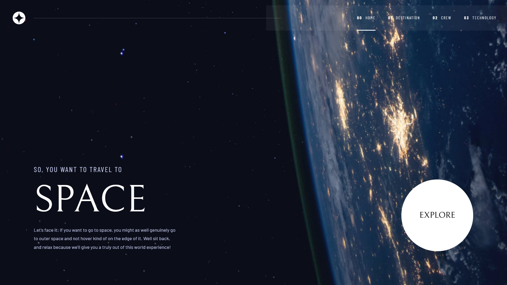

# Frontend Mentor - Space tourism website solution

This is a solution to the [Space tourism website challenge on Frontend Mentor](https://www.frontendmentor.io/challenges/space-tourism-multipage-website-gRWj1URZ3). Frontend Mentor challenges help you improve your coding skills by building realistic projects.

I'm a beginner in Front-End programming, so this is a challenge that allows me to test my skills.

## Table of contents

- [Overview](#overview)
  - [The challenge](#the-challenge)
  - [Screenshot](#screenshot)
  - [Links](#links)
- [My process](#my-process)
  - [Built with](#built-with)
  - [What I learned](#what-i-learned)
  - [Continued development](#continued-development)
  - [Author](#author)
  - [Acknowledgments](#acknowledgments)

## Overview

### The challenge

Users should be able to:

- View the optimal layout for each of the website's pages depending on their device's screen size
- See hover states for all interactive elements on the page
- View each page and be able to toggle between the tabs to see new information

### Screenshot

### Links

- Live Site URL: [Space Tourism Website](https://space-tourism-website-theta-livid.vercel.app/)

## My process

### Built with

- Semantic HTML5 markup
- CSS custom properties
- Flexbox
- CSS Grid
- Mobile-first workflow
- Vanilla JavaScript
- Tailwind CSS

### What I learned

This project was a significant learning experience, especially in managing code complexity and refactoring.

Initially, I focused on a mobile-first approach, building the homepage and navbar. As the project progressed, I completed the mobile layouts for all sections and then tackled content loading dynamically from a `.json` file.

Adding animations was another step, and then the challenge of responsiveness began. Tablet responsiveness proved to be quite an ordeal, leading to some messy code initially, which I tried my best to tidy up.

The most substantial learning curve came with desktop responsiveness. I found myself getting lost in my own code, as my initial organization with Tailwind CSS was making things more complicated than helpful. This led me to refactor the entire structure with AI's help.

Here's how the code structure changed:
Previously, the `body` had four separate `main` elements, each representing a page loaded as needed. After refactoring, the `body` now contains a single `main` element with four `section` elements inside, achieving the same result but simplifying configuration.

I also learned the importance of consistent IDs for text elements that needed dynamic loading and implemented a navbar indication for the current page. Although I couldn't fix a flickering issue with page transitions due to conflicting section classes and ultimately removed them, the process of debugging and trying to resolve it was valuable.

This project reinforced the importance of planning for scalability and maintaining clean code, even when starting with smaller components. The journey was challenging but rewarding, and I'm confident I've become more efficient through it.

### Continued development

I want to continue focusing on improving my code readability and maintainability, especially in larger projects. Refactoring proved to be a critical skill in this project, and I aim to refine it further. I also want to explore more robust solutions for page transitions and animations to avoid conflicts and ensure a smoother user experience. Finally, I will continue to practice responsiveness across various viewports to become more proficient in handling different screen sizes effectively.

## Author

- Frontend Mentor - [@Maldak123](https://www.frontendmentor.io/profile/Maldak123)

## Acknowledgments

Thanks to the Frontend Mentor community for providing such a challenging and rewarding project (and a special thanks to the Claude AI for helping me refactor my code when I was completely lost!).
